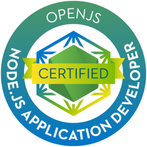

# Node.js training exercises

Following exercises helped me pass [JSNAD certification](https://training.linuxfoundation.org/certification/jsnad/) exam.

## [Certificate](https://ti-user-certificates.s3.amazonaws.com/e0df7fbf-a057-42af-8a1f-590912be5460/3bf351fe-8c3d-5973-b8d8-445fc261cba8-maxim-gherman-openjs-nodejs-application-developer-jsnad-certificate.pdf)

## [Documentation](https://www.max-gherman.dev/blog/2021/02/07/jsnad-certification)

## * [Labs](./labs) - exercises based on [Node.js 12 docs](https://nodejs.org/docs/latest-v12.x/api/)
    * Buffers
    * Child process
    * Control flow
    * Events
    * Exceptions
    * File system
    * HTTP
    * Inheritance
    * Operating System
    * Process
    * Stream

## * [Learnode](./learnode) - exercises based on [learnyounode npm package](https://www.npmjs.com/package/learnyounode)
    * File system
    * HTTP Client
    * HTTP file server
    * HTTP JSON API Server
    * Control flow (async - non async)
    * Modules
    * Async IO
    * TCP Server

## * [Scope-chains-closures](./scope-chains-closures) - exercises based on [scopes, chains and closures workshop](https://github.com/workshopper/scope-chains-closures)
    * Scopes
    * Control flow (chaining)
    * Closures

## * [Stream-adventure](./stream-adventure) - exercises based on [stream-adventure npm package](https://www.npmjs.com/package/stream-adventure)
    * File system streams
    * Process input, output streams
    * Readable stream
    * Writable stream
    * Pass-through stream
    * Duplex stream
    * HTTP server
    * WebSocket streams
    * Crypto streams

